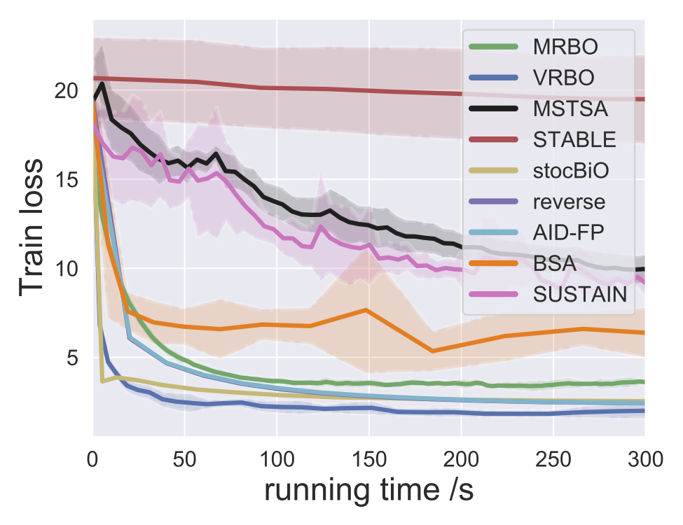
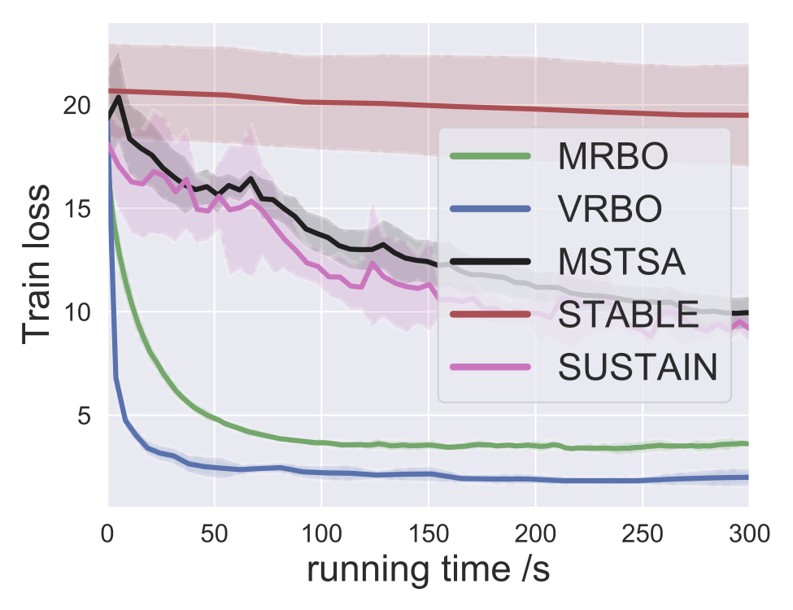
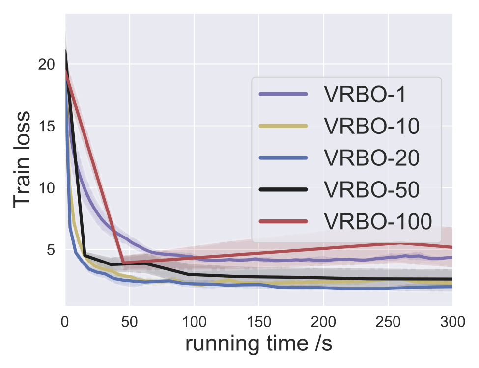

# Provably faster bilevel Optimizers MRBO & VRBO.
Codes for NeurIPS 2021 paper [Provably Faster Algorithms for Bilevel Optimization](https://arxiv.org/abs/2106.04692) by  Junjie Yang, Kaiyi Ji and Yingbin Liang. Our code is built on [stocBiO](https://github.com/JunjieYang97/StocBiO). 


## Some experiment examples

In the following, we provide some experiments to demonstrate the better performance of the proposed algorithm VRBO and MRBO. 

We compare our algorithm to various hyperparameter benchmarks on MNIST dataset:



We compare our algorithms to various momentum-based algorithms on MNIST dataset:



We evaluate the performance of our algorithm VRBO with respect to different inner-step numbers:



This repo is still under construction and any comment is welcome! 

## Citation 

If this repo is useful for your research, please cite our paper:

```tex
@inproceedings{yang2021provably,
	author = {Yang, Junjie and Ji, Kaiyi and Liang, Yingbin},
	title = {Provably Faster Algorithms for Bilevel Optimization},
	booktitle={Advances in Neural Information Processing Systems (NeurIPS)},
	year = {2021}}
```

